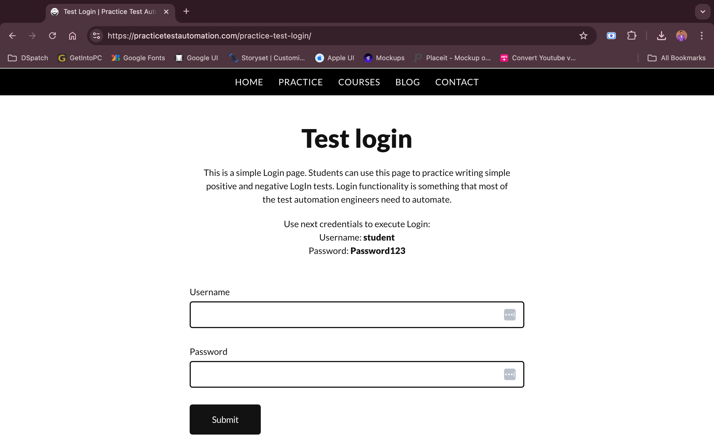
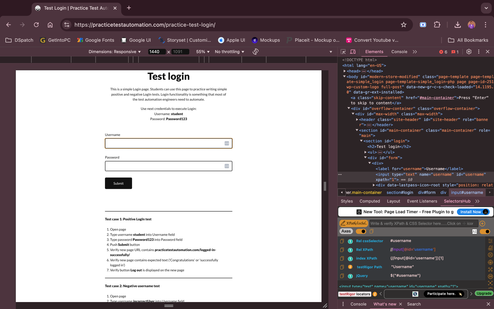

# Selenium Test Automation with Pytest

This project demonstrates a set of UI automation tests using `Selenium` and `pytest` to test the login functionality of the website [Practice Test Automation](https://practicetestautomation.com/). The tests cover both positive and negative scenarios for the login page.






## Prerequisites

Before running the tests, ensure you have the following installed on your system:

1. **Python 3.7+**: Ensure Python is installed. You can download it from [python.org](https://www.python.org/downloads/).
2. **Google Chrome**: Download and install Chrome from [here](https://www.google.com/chrome/).
3. **ChromeDriver**: Download the appropriate ChromeDriver from [ChromeDriver Downloads](https://sites.google.com/chromium.org/driver/). Ensure it's added to your system's PATH.

## Installation

Follow these steps to set up the project:

1. Clone the repository or download the project files.

2. Install the required Python dependencies. You can do this by running the following command:

    ```bash
    pip install -r requirements.txt
    ```

3. Verify that ChromeDriver is installed and available in your system's PATH.

## Running the Tests

### 1. Positive Login Test

This test case verifies the correct login functionality using valid credentials.

```bash
pytest -k test_login_page
```

### 2. Negative Login Test: Invalid Username

This test case checks the error message displayed when an invalid username is entered.

```bash
pytest -k test_negative_username
```

### 3. Negative Login Test: Invalid Password

This test case checks the error message displayed when an invalid password is entered.

```bash
pytest -k test_negative_password
```

### 4. Navigation Test

This test case verifies that the navigation to the login page works correctly.

```bash
pytest -k test_navigate_to_login_page
```

## Test Cases

### 1. `test_navigate_to_login_page`

This test navigates to the website and verifies that the user can click on the "Practice" button and subsequently reach the "Test Login Page".

- **Steps**:
  - Navigate to `https://practicetestautomation.com/`.
  - Click the "Practice" button.
  - Click the "Test Login Page" link.
  - Verify the URL is `https://practicetestautomation.com/practice-test-login/`.

### 2. `test_login_page`

This test verifies the login functionality using valid credentials (`student/Password123`).

- **Steps**:
  - Navigate to the login page.
  - Enter the valid username (`student`) and password (`Password123`).
  - Submit the form.
  - Verify the user is redirected to the success page.
  - Confirm the presence of the "Congratulations" or success message.
  - Ensure the "Log out" button is displayed.

### 3. `test_negative_username`

This test checks for the appropriate error message when an invalid username is used (`incorrectUser`).

- **Steps**:
  - Navigate to the login page.
  - Enter an invalid username (`incorrectUser`) and a valid password (`Password123`).
  - Submit the form.
  - Verify the error message "Your username is invalid!" is displayed.

### 4. `test_negative_password`

This test checks for the appropriate error message when an invalid password is used (`incorrectPassword`).

- **Steps**:
  - Navigate to the login page.
  - Enter a valid username (`student`) and an invalid password (`incorrectPassword`).
  - Submit the form.
  - Verify the error message "Your password is invalid!" is displayed.

## Folder Structure

```
selenium_pytest_project/
│
├── images/                     # Folder for storing images
│   └── Automation_Video.mov
    └── Img_1.png               # Screenshot of the website
    └── Img_2.png
    └── Img_3.png
    └── Img_4.png
├── test_script.py              # Contains the pytest test cases
├── requirements.txt            # Lists project dependencies
└── README.md                   # This documentation
```

## Running All Tests

To run all the test cases together, you can simply execute:

```bash
pytest
```

## Notes

- Each test case is structured using `pytest` fixtures to set up and tear down the WebDriver (`setup_driver()`).
- The tests use explicit waits to ensure elements are found before interacting with them.
- The ChromeDriver should match the installed version of Google Chrome for proper execution.
- Error assertions are based on messages shown on the login page.

## Future Improvements

- Add more test cases to cover edge scenarios (e.g., empty username, empty password, etc.).
- Implement headless browser execution for running tests in a CI/CD pipeline.
- Use page object model (POM) for better maintainability.